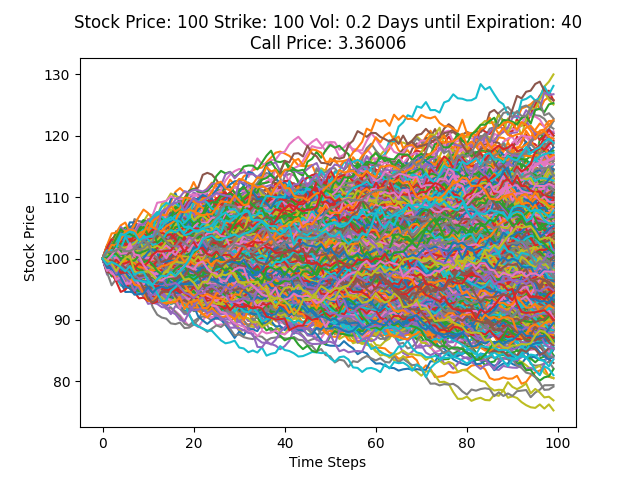

# MonteCarloOptionPricer
## Description
- price option contracts using a monte carlo simulation
- also outputs the simulation to a text file which can be plotted in plot.py
## Installation
- run `git clone` on this repository
- run `cmake CMakeLists.txt`
- run `cmake --build .`
- run `bin/main`
## Example
- after inputting the option contract information, the program will output `simulation.txt`
- run `python3 plot.py` and when prompted enter the input file name which should display a graph like the following

